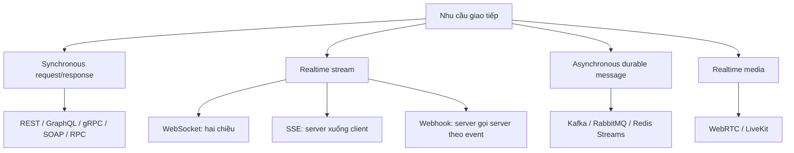
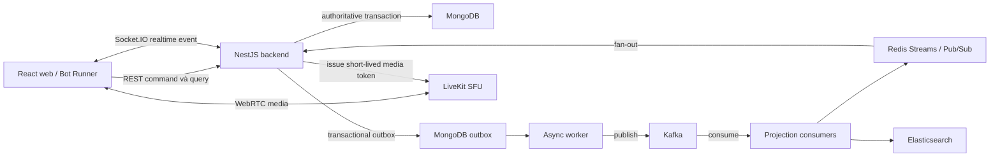
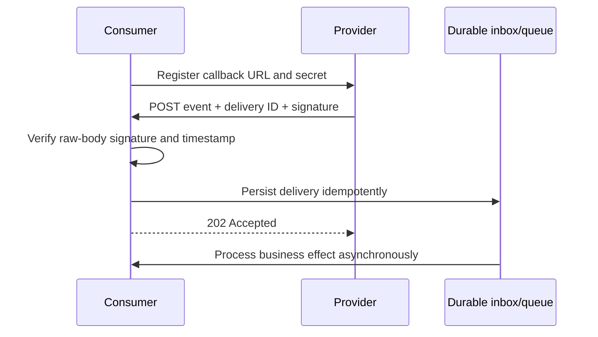
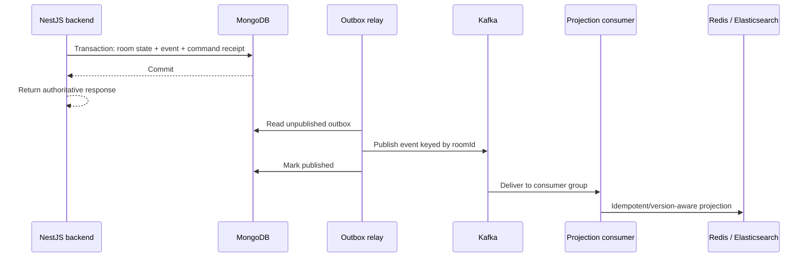
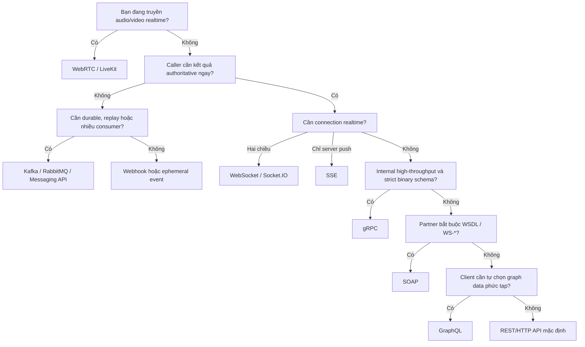

# Overview API — từ REST và SOAP đến WebSocket, gRPC và Event-driven API

Trạng thái: tài liệu nền tảng và decision guide

Cập nhật: 2026-08-06

## 1. Mục tiêu học tập

Sau khi hoàn thành tài liệu này, bạn phải có thể:

- phân biệt **API**, **endpoint**, **HTTP method**, **protocol**, **architectural style**, **API contract** và **SDK**;
- giải thích cách REST, Webhook, WebSocket, GraphQL, gRPC, SOAP, SSE và Messaging API hoạt động;
- đọc một request/response và xác định authentication, input, output, error, timeout cùng retry policy;
- chọn API style dựa trên interaction pattern, consistency, latency, scale và failure mode;
- chỉ ra API nào GameStream đang dùng thật, API nào chỉ là phương án có thể áp dụng;
- trả lời phỏng vấn theo cấu trúc `Conclusion → Mechanism → Trade-off → GameStream example`.

## 2. Có bao nhiêu loại API?

Không có một con số cố định. Các tên như REST, SOAP, GraphQL và WebSocket không nằm hoàn toàn trên cùng một tầng abstraction:

| Khái niệm          | Bản chất                                                              |
| ------------------ | --------------------------------------------------------------------- |
| REST               | Architectural style với các constraint                                |
| SOAP               | XML messaging protocol/framework                                      |
| GraphQL            | Query language, type system và execution model                        |
| gRPC               | Remote Procedure Call framework, thường dùng Protocol Buffers         |
| WebSocket          | Full-duplex network protocol sau opening handshake                    |
| SSE                | Cơ chế server-to-client event stream qua HTTP                         |
| Webhook            | Event notification pattern dùng HTTP callback                         |
| Kafka/RabbitMQ API | Asynchronous message/event contract qua broker                        |
| JSON-RPC/XML-RPC   | Remote procedure call protocol                                        |
| OData              | Standardized data API protocol xây trên HTTP                          |
| WebRTC             | Realtime media/data communication stack, không phải business CRUD API |

Vì vậy, câu hỏi đúng không phải là “có chính xác bao nhiêu API”, mà là:

> Hệ thống cần interaction pattern nào, guarantee nào và API contract nào?

## 3. Thứ tự ưu tiên nghiên cứu

|     Ưu tiên | Loại API                   | Vì sao cần học                                    | Trạng thái trong GameStream                                            |
| ----------: | -------------------------- | ------------------------------------------------- | ---------------------------------------------------------------------- |
|           1 | REST/HTTP API              | Phổ biến nhất cho web/mobile và public API        | Đang dùng cho Auth, Room, Chat history, Search, LiveKit token và Admin |
|           2 | Webhook                    | Cách phổ biến để hệ thống bên ngoài push event    | Chưa implement                                                         |
|           3 | WebSocket/Socket.IO        | Realtime bidirectional communication              | Đang dùng cho game, chat và admin monitoring                           |
|           4 | GraphQL                    | Client-driven query với typed schema              | Chưa implement                                                         |
|           5 | gRPC                       | Internal service-to-service API hiệu năng cao     | Chưa implement                                                         |
|           6 | SOAP/WSDL                  | Quan trọng trong enterprise và legacy integration | Chưa implement                                                         |
|           7 | Server-Sent Events         | Server push một chiều, đơn giản hơn WebSocket     | Chưa implement                                                         |
|           8 | Event-driven/Messaging API | Durable asynchronous integration                  | Đang dùng MongoDB outbox, Kafka, Redis Streams/Pub/Sub                 |
|           9 | JSON-RPC/XML-RPC           | Hiểu RPC model và legacy integration              | Chưa implement                                                         |
|          10 | OData                      | Standard query cho enterprise data API            | Chưa implement                                                         |
| Chuyên biệt | WebRTC/LiveKit             | Audio/video realtime                              | Đang dùng cho livestream                                               |

## 4. Nền tảng bắt buộc trước khi học từng loại API

### 4.1 API là gì?

**Application Programming Interface** là contract cho phép một software component tương tác với component khác mà không cần biết toàn bộ implementation bên trong.

Một API contract hoàn chỉnh cần mô tả:

- operation hoặc event nào được hỗ trợ;
- endpoint/channel và protocol;
- input, output, header, metadata và schema;
- authentication và authorization;
- success/error semantics;
- timeout, retry, idempotency và ordering guarantee;
- versioning và compatibility policy;
- rate limit, quota và observability.

### 4.2 Các thuật ngữ thường bị nhầm

| Thuật ngữ         | Ý nghĩa                                 | Ví dụ GameStream                          |
| ----------------- | --------------------------------------- | ----------------------------------------- |
| API               | Toàn bộ interface được cung cấp         | Room API                                  |
| Endpoint          | Một địa chỉ và operation cụ thể         | `POST /api/rooms/:roomId/start`           |
| HTTP method       | Semantics của HTTP request              | `GET`, `POST`, `PUT`, `PATCH`, `DELETE`   |
| Resource          | Đối tượng được nhận diện bởi URI        | `/api/rooms/:roomId`                      |
| Command           | Yêu cầu làm thay đổi state              | `start`, `roll`, `cancel`                 |
| Query             | Yêu cầu đọc dữ liệu                     | `GET /api/search/rooms`                   |
| Protocol          | Quy tắc trao đổi trên wire              | HTTP, WebSocket, AMQP                     |
| Schema            | Cấu trúc và constraint của data         | Zod schema, GraphQL schema, `.proto`, XSD |
| API specification | Mô tả machine-readable của contract     | OpenAPI, AsyncAPI, WSDL                   |
| SDK/client        | Code bọc protocol để gọi API thuận tiện | `socket.io-client`, LiveKit SDK           |

JWT, OAuth, API key và session cookie là cơ chế security; chúng không phải API style.

### 4.3 Các chiều phân loại quan trọng



Khi phân tích API, hãy luôn hỏi:

1. Caller có cần response ngay không?
2. Ai chủ động gửi dữ liệu: client, server hay cả hai?
3. Message có phải survive process/broker restart không?
4. Có cần ordering, replay hoặc consumer độc lập không?
5. Client là browser, mobile, internal service hay legacy enterprise system?
6. Payload là JSON document, binary message, XML hay audio/video?

## 5. API landscape hiện tại của GameStream



Các file code quan trọng:

- [HTTP bootstrap](../../../src/apps/backend/src/main.ts): prefix `/api`, CORS, Helmet và cookie parser;
- [Rooms REST controller](../../../src/apps/backend/src/rooms/rooms.controller.ts): create, get, join, ready, start, roll và cancel;
- [Web API client](../../../src/apps/web/src/api.ts): `fetch`, Bearer token, cookie và error handling;
- [Socket.IO gateway](../../../src/apps/backend/src/realtime/realtime.gateway.ts): authentication, room subscription, chat và recovery;
- [Shared contracts](../../../src/packages/contracts/src/index.ts): Zod input schema, socket event name và integration-event envelope;
- [Outbox relay](../../../src/apps/worker/src/outbox-relay.ts): publish event từ MongoDB sang Kafka;
- [Projection consumers](../../../src/apps/worker/src/projections.ts): Kafka sang Redis/Elasticsearch;
- [LiveKit token service](../../../src/apps/backend/src/live/live.service.ts): media grant theo room role.

## 6. REST API — lựa chọn mặc định cho web API

### 6.1 REST là gì?

REST là architectural style do Roy Fielding mô tả. Các constraint chính gồm client-server, stateless, cacheable, uniform interface, layered system và optional code-on-demand. REST không đồng nghĩa với “HTTP + JSON”, dù HTTP/JSON là cách implement phổ biến.

Uniform interface nhấn mạnh:

- resource được nhận diện bằng URI;
- client thao tác resource thông qua representation;
- message tự mô tả;
- hypermedia có thể điều khiển application state.

### 6.2 Request REST gồm những gì?

```http
POST /api/rooms/7c1f/start HTTP/1.1
Host: game.example.com
Authorization: Bearer eyJhbGciOi...
Content-Type: application/json
X-Request-Id: req-82f5

{
  "commandId": "bb41a340-3b56-42e7-a50e-3232d5d89e0d",
  "expectedVersion": 8
}
```

Phân tích:

- `POST` biểu diễn operation có side effect;
- URI xác định room và command `start`;
- Bearer token xác thực user;
- `commandId` tạo idempotency ở application level;
- `expectedVersion` cung cấp optimistic concurrency control;
- request ID hỗ trợ correlation và tracing.

GameStream implement endpoint này trong `RoomsController`:

```ts
@Post(':roomId/start')
public start(
  @CurrentUser() user: AuthenticatedUser,
  @Param('roomId') roomId: string,
  @Body(new ZodValidationPipe(roomCommandSchema)) input: RoomCommandInput,
) {
  return this.rooms.start(user.userId, roomId, input);
}
```

### 6.3 HTTP methods và semantics

| Method    | Mục đích                                  |  Safe | Idempotent theo semantics | Ví dụ                   |
| --------- | ----------------------------------------- | ----: | ------------------------: | ----------------------- |
| `GET`     | Đọc representation                        |    Có |                        Có | `GET /api/rooms/:id`    |
| `HEAD`    | Lấy header như GET, không lấy body        |    Có |                        Có | Kiểm tra metadata       |
| `POST`    | Create hoặc process command               | Không |            Không mặc định | `POST /rooms/:id/start` |
| `PUT`     | Tạo/thay thế toàn bộ state tại target URI | Không |                        Có | `PUT /profiles/:id`     |
| `PATCH`   | Partial modification                      | Không |        Không được đảm bảo | `PATCH /profiles/:id`   |
| `DELETE`  | Yêu cầu xóa target resource               | Không |                        Có | `DELETE /sessions/:id`  |
| `OPTIONS` | Hỏi capability/communication option       |    Có |                        Có | CORS preflight          |

**Safe** nghĩa là client không yêu cầu thay đổi server state. Logging hoặc metrics nội bộ vẫn có thể thay đổi.

**Idempotent** nghĩa là nhiều request giống nhau có intended effect tương đương một request. Nó không có nghĩa response phải giống hoàn toàn hoặc server không ghi log.

POST có thể được làm idempotent ở application layer bằng idempotency key/command ID. GameStream lưu command receipt theo `commandId`, nên client retry command không tạo lại business effect.

### 6.4 Resource endpoint và command endpoint

Pure resource style:

```text
PATCH /api/rooms/:roomId
{ "status": "ACTIVE" }
```

Command-oriented style:

```text
POST /api/rooms/:roomId/start
{ "commandId": "...", "expectedVersion": 8 }
```

GameStream chọn command endpoint vì `start`, `roll` và `cancel` có business invariant khác nhau. Server không cho client tùy ý patch `status`, `currentTurn` hoặc `score`.

### 6.5 Status code cần nhớ

|                        Code | Khi dùng                                       | Lỗi thường gặp                                 |
| --------------------------: | ---------------------------------------------- | ---------------------------------------------- |
|                    `200 OK` | Thành công và có response body                 | Dùng cho mọi trường hợp mà không nêu semantics |
|               `201 Created` | Tạo resource thành công; nên có `Location`     | Tạo xong nhưng vẫn trả `200` không rõ nghĩa    |
|              `202 Accepted` | Đã nhận nhưng xử lý asynchronous chưa hoàn tất | Trả `202` nhưng không có status/job resource   |
|            `204 No Content` | Thành công và không có body                    | Vẫn gửi JSON body                              |
|           `400 Bad Request` | Syntax hoặc request không hợp lệ               | Dùng cho mọi business conflict                 |
|          `401 Unauthorized` | Thiếu hoặc invalid authentication              | Nhầm với insufficient permission               |
|             `403 Forbidden` | Đã xác thực nhưng không có quyền               | Trả `401` cho user đã login                    |
|             `404 Not Found` | Resource không tồn tại hoặc được che giấu      | Lộ resource existence không cần thiết          |
|              `409 Conflict` | Conflict với current resource state            | Phù hợp version conflict của room              |
|   `412 Precondition Failed` | `If-Match`/precondition thất bại               | Bỏ qua conditional request                     |
| `422 Unprocessable Content` | Syntax đúng nhưng semantic validation sai      | Trộn validation và server error                |
|     `429 Too Many Requests` | Vượt rate limit                                | Không cung cấp retry guidance                  |
| `500 Internal Server Error` | Unexpected server failure                      | Trả stack trace cho client                     |
|               `502/503/504` | Upstream bad gateway/unavailable/timeout       | Retry không giới hạn gây retry storm           |

### 6.6 Input validation và trust boundary

TypeScript type biến mất ở runtime. Mọi input từ HTTP, socket, Kafka, database hoặc OAuth provider phải được xem là `unknown` cho tới khi validate.

GameStream dùng `ZodValidationPipe` và shared Zod schema:

```ts
export const roomCommandSchema = z.object({
  commandId: z.string().uuid(),
  expectedVersion: z.number().int().positive(),
});
```

Validation cần kiểm tra cả:

- shape và data type;
- length, range, enum và format;
- authentication và authorization;
- business invariant;
- object-level authorization: user có quyền trên đúng `roomId` không.

### 6.7 Error contract

Không nên chỉ trả chuỗi như `"Something went wrong"`. Error response cần ổn định và machine-readable:

```json
{
  "type": "https://gamestream.dev/problems/version-conflict",
  "title": "Room version conflict",
  "status": 409,
  "code": "ROOM_VERSION_CONFLICT",
  "detail": "Expected version 8 but the current version is 9.",
  "requestId": "req-82f5"
}
```

Nguyên tắc:

- `code` ổn định cho client logic;
- `detail` dành cho con người và có thể thay đổi;
- không lộ stack trace, SQL, secret hoặc internal topology;
- log server giữ error cause cùng request/correlation ID.

### 6.8 Pagination, filtering và sorting

Không trả collection không giới hạn.

**Offset pagination**:

```text
GET /api/rooms?limit=20&offset=40
```

- dễ hiểu và cho phép nhảy trang;
- page lớn có thể chậm và dữ liệu mới làm item dịch chuyển.

**Cursor pagination**:

```text
GET /api/rooms?limit=20&after=eyJ1cGRhdGVkQXQiOi...
```

- ổn định và hiệu quả hơn cho feed lớn;
- không thuận tiện để nhảy trực tiếp tới page bất kỳ;
- cursor phải opaque, signed hoặc validated.

GameStream search hiện giới hạn `limit` từ 1 đến 50. Chat history dùng `before` để đọc message cũ.

### 6.9 Caching

REST tận dụng HTTP cache tốt khi resource và header được thiết kế đúng:

- `Cache-Control: public, max-age=60` cho public immutable/low-risk data;
- `Cache-Control: private` cho response riêng của user;
- `Cache-Control: no-store` cho token hoặc sensitive response;
- `ETag` với `If-None-Match` để nhận `304 Not Modified`;
- `Vary` khi representation phụ thuộc header như `Accept-Encoding`.

Không cache authenticated response trong shared cache nếu chưa định nghĩa policy rõ. Room authoritative state thay đổi nhanh nên cần conservative caching và version-aware invalidation.

### 6.10 Timeout, retry và idempotency

Mọi network call cần timeout/deadline. Retry chỉ phù hợp khi:

- failure có tính transient;
- operation safe/idempotent, hoặc có idempotency key;
- có giới hạn attempt, exponential backoff và jitter;
- caller tôn trọng total deadline;
- retry được đo bằng metric.

Không blanket retry mọi `POST`. Nếu client timeout sau khi server đã commit `start game`, retry không có `commandId` có thể thực thi lần hai.

### 6.11 REST nên và không nên dùng khi nào?

**Nên dùng khi:**

- browser/mobile cần CRUD hoặc synchronous command/query;
- API cần dễ debug bằng browser, curl, Postman;
- muốn tận dụng HTTP proxy, cache, status code và OpenAPI tooling;
- public API cần interoperability rộng.

**Không nên dùng làm lựa chọn duy nhất khi:**

- cần server push liên tục với latency thấp;
- cần full-duplex chat/game events;
- cần durable asynchronous fan-out và replay;
- cần truyền audio/video realtime;
- internal call yêu cầu binary schema và streaming hiệu năng cao.

## 7. Webhook — HTTP callback theo event

### 7.1 Cơ chế

Webhook đảo chiều polling. Consumer đăng ký callback URL; khi event xảy ra, provider gửi HTTP request tới URL đó.



### 7.2 Ví dụ payload

```http
POST /api/webhooks/tournament HTTP/1.1
Content-Type: application/json
X-Webhook-Id: delivery-20260806-0019
X-Webhook-Timestamp: 1785989400
X-Webhook-Signature: sha256=77a0...

{
  "type": "tournament.registration_confirmed",
  "occurredAt": "2026-08-06T09:30:00Z",
  "data": {
    "tournamentId": "summer-dice-2026",
    "userId": "user-42"
  }
}
```

### 7.3 Receiver an toàn phải làm gì?

1. Đọc **raw request body** trước khi JSON transform.
2. Tính HMAC bằng webhook secret.
3. So sánh signature bằng constant-time comparison và kiểm tra length trước khi so sánh.
4. Kiểm tra timestamp tolerance để giảm replay attack.
5. Validate event schema và supported version.
6. Deduplicate bằng provider + delivery ID trong durable inbox.
7. Persist nhanh rồi trả `2xx`; xử lý nặng ở background.
8. Trả non-2xx cho failure cần provider retry.
9. Monitor delivery age, retry count, signature failure và poison event.

### 7.4 Retry và idempotency

Webhook thường có at-least-once delivery ở application level: provider có thể gửi lại khi timeout hoặc nhận non-2xx. Receiver phải idempotent.

Không được giả định “đã nhận một lần thì không bao giờ nhận lại”. Cũng không nên trả `200` trước khi event được lưu durable, vì process crash sau response sẽ làm mất event.

### 7.5 GameStream có dùng Webhook không?

Hiện tại **không**. Use case hợp lý trong tương lai:

- payment provider báo thanh toán tournament;
- moderation service trả kết quả kiểm duyệt;
- external tournament platform thông báo lịch hoặc registration;
- CI/CD hoặc incident platform gửi deployment/alert event.

Không dùng Webhook cho browser chat realtime: browser không phải public durable callback server và interaction đó cần connection/session khác.

## 8. WebSocket và Socket.IO — realtime hai chiều

### 8.1 WebSocket hoạt động thế nào?

WebSocket bắt đầu bằng opening handshake, sau đó tạo một connection lâu dài cho phép client và server độc lập gửi message theo cả hai chiều.

Socket.IO không phải raw WebSocket protocol. Đây là higher-level realtime library cung cấp event abstraction, acknowledgement, namespace, room, reconnection và có thể fallback sang HTTP long-polling.

### 8.2 GameStream implementation

Client kết nối namespace `/realtime`:

```ts
const socket = io("/realtime", {
  auth: { token: accessToken },
  transports: ["websocket", "polling"],
});

socket.emit(SOCKET_EVENTS.JOIN_ROOM, { roomId, lastSequence }, (response) =>
  applyRecovery(response),
);

socket.on(SOCKET_EVENTS.ROOM_EVENT, () => loadRoom());
socket.on(SOCKET_EVENTS.CHAT_CREATED, (message) => appendMessage(message));
```

Server validate access token ở handshake, lưu presence trong Redis, cho socket join `room:<roomId>` và validate payload bằng Zod.

### 8.3 Lifecycle phải xử lý

- connect và authenticate;
- join/leave logical room;
- heartbeat/presence expiration;
- disconnect và reconnect;
- resubscribe sau reconnect;
- missed-event recovery hoặc authoritative snapshot reload;
- duplicate/out-of-order event handling;
- backpressure và slow consumer;
- graceful shutdown và deploy reconnect storm.

### 8.4 Delivery guarantee

TCP giữ byte order trong một connection, nhưng application delivery guarantee không tự động trở thành exactly-once. Socket.IO bảo toàn event ordering, còn arrival mặc định là at-most-once nếu không xây thêm recovery.

GameStream dùng hai tầng recovery:

- Redis Streams giữ bounded recent event history;
- MongoDB room snapshot/version là authoritative fallback khi client disconnect lâu hoặc stream không còn đủ event.

Client vẫn cần xử lý event ID/version idempotently và reload snapshot khi phát hiện gap.

### 8.5 Scale và failure

WebSocket là stateful connection. Khi chạy nhiều gateway instance cần xem xét:

- load balancer và sticky session khi long-polling được bật;
- shared adapter hoặc external fan-out mechanism;
- mỗi instance chỉ giữ socket local của nó;
- connection count, memory, heartbeat và file descriptor;
- rolling deployment tạo reconnect burst;
- broker/Redis outage không được làm corrupt authoritative game state.

### 8.6 Nên và không nên dùng

**Nên dùng khi:** chat, multiplayer game, collaborative editing, trading feed cần bidirectional low-latency interaction.

**Không nên dùng khi:** request hiếm và đơn giản; chỉ cần server push một chiều; cần durable offline delivery; cần CDN/HTTP cache; client không thể giữ connection lâu dài.

## 9. GraphQL — client chỉ định data shape

### 9.1 Cơ chế

GraphQL service publish typed schema. Client gửi query chỉ rõ field cần lấy; execution engine gọi resolver và tạo response theo query shape.

Schema minh họa cho GameStream — **chưa có trong code hiện tại**:

```graphql
type Query {
  room(id: ID!): Room!
  rooms(search: String, first: Int!, after: String): RoomConnection!
}

type Mutation {
  startRoom(input: StartRoomInput!): Room!
}

input StartRoomInput {
  roomId: ID!
  commandId: ID!
  expectedVersion: Int!
}
```

Client query:

```graphql
query RoomScreen($roomId: ID!) {
  room(id: $roomId) {
    roomId
    name
    status
    version
    players {
      userId
      username
      score
      ready
    }
  }
}
```

### 9.2 Ưu điểm

- client lấy đúng field cần cho một screen;
- typed schema, introspection và tooling mạnh;
- aggregate nhiều data source sau một graph API;
- schema có thể evolve bằng additive field và deprecation.

### 9.3 Chi phí và failure mode

- N+1 query cần batching/DataLoader;
- query depth/breadth có thể gây resource exhaustion;
- authorization phải kiểm tra ở object/field/business layer;
- HTTP caching khó trực tiếp hơn resource URL;
- response có thể chứa cả `data` và `errors`;
- schema federation thêm ownership và operational complexity;
- mutation vẫn cần idempotency, concurrency và transaction như REST.

### 9.4 Khi nào dùng?

**Nên dùng:** nhiều frontend có data requirement khác nhau; domain graph phong phú; REST tạo quá nhiều endpoint aggregation hoặc over-fetching/under-fetching có bằng chứng.

**Không nên dùng:** CRUD nhỏ; team chưa có schema governance; API chủ yếu command; cần simple CDN caching; chưa đo được vấn đề mà GraphQL giải quyết.

GameStream hiện chưa cần GraphQL. REST endpoint rõ ràng và realtime state đi qua Socket.IO. Chỉ cân nhắc GraphQL nếu lobby/profile/tournament UI phát triển thành graph query phức tạp.

## 10. gRPC — typed RPC cho internal services

### 10.1 Cơ chế

gRPC định nghĩa service và message trong `.proto`, generate client/server code, thường truyền binary Protocol Buffers qua HTTP/2.

Ví dụ đề xuất — **chưa có trong code hiện tại**:

```proto
syntax = "proto3";

package gamestream.room.v1;

service RoomService {
  rpc GetRoom(GetRoomRequest) returns (RoomReply);
  rpc StartRoom(StartRoomRequest) returns (RoomReply);
  rpc WatchRoom(WatchRoomRequest) returns (stream RoomEvent);
}

message StartRoomRequest {
  string room_id = 1;
  string command_id = 2;
  int64 expected_version = 3;
}
```

### 10.2 Bốn RPC pattern

1. Unary: một request, một response.
2. Server streaming: một request, nhiều response.
3. Client streaming: nhiều request, một response.
4. Bidirectional streaming: hai phía gửi stream độc lập.

### 10.3 Điểm phải thiết kế

- luôn đặt realistic deadline; default không nên là đợi vô hạn;
- propagate cancellation xuống database/upstream work;
- retry chỉ method phù hợp, có backoff và retry budget;
- mapping domain error sang gRPC status rõ ràng;
- metadata chứa auth/correlation, không nhét business payload tùy tiện;
- field number không được reuse sau khi remove; reserve field cũ;
- health check, reflection và OpenTelemetry;
- browser thường cần gRPC-Web/proxy hoặc Connect-style bridge.

### 10.4 Nên và không nên dùng

**Nên dùng:** internal microservices đa ngôn ngữ, strict schema, high throughput, low payload overhead hoặc streaming.

**Không nên dùng:** public browser API cần debug đơn giản; hệ thống vẫn là modular monolith; partner chỉ hỗ trợ HTTP/JSON; team chưa vận hành HTTP/2/load balancing/tooling.

GameStream chỉ nên cân nhắc gRPC sau khi có bằng chứng cần tách business service. Gọi module trong cùng process bằng gRPC chỉ thêm network failure mà không tạo business boundary.

## 11. SOAP — contract-first enterprise integration

### 11.1 SOAP là gì?

SOAP là XML messaging framework. SOAP message có `Envelope`, optional `Header`, `Body` và `Fault`. SOAP có thể bind lên HTTP hoặc transport khác; SOAP không đồng nghĩa với HTTP.

```xml
<?xml version="1.0" encoding="UTF-8"?>
<soap:Envelope xmlns:soap="http://www.w3.org/2003/05/soap-envelope"
               xmlns:game="https://gamestream.dev/contracts/room/v1">
  <soap:Header>
    <game:CorrelationId>req-82f5</game:CorrelationId>
  </soap:Header>
  <soap:Body>
    <game:GetRoomRequest>
      <game:RoomId>7c1f</game:RoomId>
    </game:GetRoomRequest>
  </soap:Body>
</soap:Envelope>
```

WSDL mô tả operation, message, type, binding và endpoint. XSD định nghĩa XML schema. Các WS-* specification có thể cung cấp security, reliable messaging, transaction hoặc addressing tùy ecosystem; không được giả định mọi SOAP service tự động bật tất cả feature này.

### 11.2 Ưu điểm

- contract-first và schema rất nghiêm ngặt;
- tooling generate client trong enterprise ecosystem;
- standardized fault/message processing;
- phù hợp integration có WSDL/XSD và WS-Security bắt buộc.

### 11.3 Nhược điểm

- XML verbose và parsing/tooling phức tạp;
- debugging thủ công nặng hơn JSON API;
- WS-* interoperability cần kiểm thử giữa vendor;
- không phù hợp low-latency browser/game event.

### 11.4 Khi nào dùng?

**Nên dùng:** ngân hàng, bảo hiểm, chính phủ hoặc legacy enterprise partner bắt buộc WSDL/WS-Security và đã có governance SOAP.

**Không nên dùng:** greenfield web/mobile CRUD, realtime game, internal call đơn giản hoặc khi không có external contract bắt buộc.

GameStream hiện không có SOAP. Chỉ thêm SOAP adapter ở integration boundary nếu một partner yêu cầu; không để generated SOAP type lan vào domain model.

## 12. Server-Sent Events — server push một chiều

### 12.1 Cơ chế

Browser tạo `EventSource`; server giữ HTTP response với `Content-Type: text/event-stream` và gửi UTF-8 event liên tục.

```text
id: 42
event: admin.snapshot
data: {"overallStatus":"HEALTHY","requestsLastMinute":127}

```

```ts
const source = new EventSource("/api/admin/events", { withCredentials: true });

source.addEventListener("admin.snapshot", (event) => {
  const snapshot = JSON.parse((event as MessageEvent).data);
  renderDashboard(snapshot);
});
```

Browser tự reconnect. Server có thể gửi `id`; browser dùng `Last-Event-ID` để hỗ trợ resume. Native `EventSource` không thuận tiện để đặt arbitrary `Authorization` header, nên thường dùng secure cookie, same-origin session hoặc signed short-lived URL.

### 12.2 Nên và không nên dùng

**Nên dùng:** notification, log tail, progress, monitoring hoặc feed mà chỉ server gửi dữ liệu xuống browser.

**Không nên dùng:** chat/game control hai chiều; binary payload; client-to-server stream; durable message processing; media.

Admin monitoring GameStream hiện dùng REST initial snapshot + Socket.IO update. Nếu requirement chỉ còn server push một chiều, SSE là phương án đơn giản hơn.

## 13. Event-driven và Messaging API

### 13.1 Đây có phải API không?

Có. API contract không nhất thiết là HTTP endpoint. Với event-driven API, contract gồm channel/topic, event name, key, header, payload schema, ordering, delivery và compatibility rule. AsyncAPI có thể mô tả contract dạng này.

### 13.2 GameStream flow



Integration event contract hiện tại:

```ts
interface IntegrationEvent<TPayload = unknown> {
  eventId: string;
  type: string;
  aggregateId: string;
  aggregateVersion: number;
  occurredAt: string;
  correlationId: string;
  causationId: string;
  schemaVersion: 1;
  payload: TPayload;
}
```

### 13.3 Guarantee phải hiểu

- ordering thường chỉ trong partition/queue, không phải toàn hệ thống;
- at-least-once có thể tạo duplicate;
- consumer phải idempotent hoặc version-aware;
- producer/database dual-write cần transactional outbox hoặc cơ chế tương đương;
- retry không giới hạn tạo poison-message loop;
- consumer lag là freshness problem dù broker vẫn healthy;
- replay phải không làm hỏng current projection;
- schema evolution cần version và compatibility policy;
- event chứa fact đã xảy ra, không phải mutable database row dump tùy tiện.

### 13.4 Kafka, RabbitMQ và Redis Streams khác vai trò

| Công nghệ     | Điểm mạnh                                                           | Không nên hiểu sai                                           |
| ------------- | ------------------------------------------------------------------- | ------------------------------------------------------------ |
| Kafka         | Durable retained log, partition, replay, independent consumer group | Không phải synchronous database transaction xuyên mọi system |
| RabbitMQ      | Routing, work queue, acknowledgement, per-message workflow          | Không mặc định là long-retention event history               |
| Redis Streams | Fast bounded stream, consumer group, recovery window                | Không thay authoritative durable state nếu retention ngắn    |
| Redis Pub/Sub | Low-latency ephemeral fan-out                                       | Subscriber offline sẽ không nhận message đã bỏ lỡ            |

### 13.5 Nên và không nên dùng

**Nên dùng:** background processing, domain/integration event, fan-out nhiều consumer, audit/replay, projection và workload cần decoupling theo thời gian.

**Không nên dùng:** caller cần immediate authoritative result; request/reply đơn giản; business transaction không chấp nhận eventual consistency; team chưa có monitoring lag, retry và schema governance.

GameStream dùng HTTP/MongoDB cho `start` và `roll` vì caller cần kết quả authoritative ngay; Kafka cập nhật projection/search/realtime sau commit.

## 14. JSON-RPC và XML-RPC

RPC model tập trung vào method thay vì resource.

```json
{
  "jsonrpc": "2.0",
  "method": "room.start",
  "params": {
    "roomId": "7c1f",
    "commandId": "bb41a340-3b56-42e7-a50e-3232d5d89e0d",
    "expectedVersion": 8
  },
  "id": 19
}
```

JSON-RPC định nghĩa `jsonrpc`, `method`, `params` và `id`; notification không có `id` và không có response. XML-RPC dùng XML và là lựa chọn legacy đơn giản hơn SOAP.

**Nên dùng:** hệ thống đã chuẩn hóa RPC method, plugin/automation endpoint hoặc transport-specific API không cần resource semantics.

**Không nên dùng:** muốn tận dụng rõ HTTP method/status/cache/resource tooling; cần typed code generation mạnh như gRPC; API public cần convention REST phổ biến.

GameStream không có JSON-RPC/XML-RPC. Các game command hiện có RPC-like semantics nhưng được expose bằng HTTP command endpoint có validation và status code.

## 15. OData

OData chuẩn hóa data model và query option như `$filter`, `$select`, `$expand`, `$orderby`, `$top`, `$skip` và `$count`.

```http
GET /odata/Rooms?$filter=status eq 'LOBBY'&$select=roomId,name&$top=20
```

**Nên dùng:** enterprise data service cần query convention/tooling đồng nhất, đặc biệt trong ecosystem đã hỗ trợ OData.

**Không nên dùng:** command-heavy domain; không muốn expose query complexity; authorization/filtering khó kiểm soát; simple endpoint đã đủ.

GameStream search có query nhỏ và bounded, nên custom REST endpoint rõ hơn OData.

## 16. WebRTC và LiveKit — media plane riêng

WebRTC không thay REST, GraphQL hay Socket.IO. Nó giải quyết realtime audio/video/data transport qua signalling, ICE, DTLS, SRTP và RTP-related media mechanisms.

GameStream dùng:

1. REST gọi `/api/rooms/:roomId/live/token`;
2. backend xác thực membership và chỉ cấp publish grant cho owner;
3. client dùng token kết nối LiveKit;
4. audio/video đi qua LiveKit SFU bằng WebRTC;
5. game state và chat vẫn đi qua REST/Socket.IO.

Không truyền video frames dưới dạng JSON REST response hoặc Kafka event.

## 17. API contract và documentation

| API style    | Contract phù hợp                                  |
| ------------ | ------------------------------------------------- |
| HTTP/REST    | OpenAPI + JSON Schema                             |
| GraphQL      | GraphQL schema/SDL                                |
| gRPC         | Protocol Buffer `.proto`                          |
| SOAP         | WSDL + XSD                                        |
| Event-driven | AsyncAPI + event schema                           |
| Socket.IO    | AsyncAPI hoặc shared event schema/custom contract |

Contract-first giúp generate client, mock server, validate compatibility và review breaking change. Code-first thuận tiện khởi đầu nhưng vẫn phải export machine-readable contract để consumer không phụ thuộc vào việc đọc implementation.

## 18. Cross-cutting concerns áp dụng cho mọi API

### 18.1 Authentication và authorization

- Authentication trả lời “caller là ai?”.
- Authorization trả lời “caller được làm gì trên resource cụ thể?”.
- API key phù hợp identify application nhưng thường không đại diện end-user đầy đủ.
- OAuth 2.0 là authorization framework; OIDC thêm identity layer.
- JWT là token format, không tự tạo revoke, rotation hoặc authorization policy.
- mTLS phù hợp service identity ở trust boundary cần mutual authentication.
- Webhook thường dùng HMAC signature; không coi IP allowlist là biện pháp duy nhất.

GameStream dùng access JWT cho HTTP/Socket.IO, refresh cookie được rotate và LiveKit token có grant hẹp, thời hạn ngắn.

### 18.2 Timeout, retry, circuit breaker và bulkhead

- timeout giới hạn thời gian chờ;
- deadline là total time budget truyền qua call chain;
- retry xử lý transient failure nhưng tăng load;
- circuit breaker ngừng gọi upstream đang fail liên tục;
- bulkhead giới hạn concurrency để một dependency không chiếm toàn bộ resource;
- retry phải có attempt limit, exponential backoff, jitter và observability.

### 18.3 Rate limit và backpressure

- rate limit theo user/app/IP/tenant tùy threat model;
- trả `429` và retry guidance khi phù hợp;
- WebSocket cần per-event rate/concurrency/queue limit;
- stream cần bounded buffer và slow-consumer policy;
- broker cần monitor lag/age, không chỉ queue length;
- reject hoặc degrade optional work trước khi hệ thống kiệt resource.

### 18.4 Versioning và compatibility

- URL: `/api/v1/rooms` — rõ nhưng tạo duplicate route;
- header/media type — sạch URL nhưng khó debug/discover hơn;
- additive evolution — thêm optional field, không đổi nghĩa field cũ;
- breaking change — version contract/topic/schema mới;
- event cần schema version và tolerant reader;
- gRPC không reuse field number;
- GraphQL deprecate field rồi đo usage trước khi remove.

### 18.5 Observability

Tối thiểu cần:

- request/event count, error rate, latency percentile và saturation;
- correlation ID, causation ID, user/tenant context an toàn;
- distributed trace qua synchronous và asynchronous hop;
- WebSocket connection/reconnect/disconnect count;
- webhook delivery age/retry/signature failure;
- Kafka outbox age, consumer lag và poison-event count;
- log không chứa access token, refresh token, password hoặc raw sensitive payload.

### 18.6 Testing pyramid cho API

1. Schema/unit test: input, output, serializer và error mapping.
2. Controller/handler integration test: auth, validation, status code.
3. Database/broker integration test: transaction, idempotency, ordering.
4. Contract test: producer-consumer compatibility.
5. End-to-end test: đi qua public ingress giống client thật.
6. Load test: latency, connection, backpressure và rate limit.
7. Failure test: timeout, duplicate, reconnect, dependency down và replay.
8. Security test: broken object authorization, injection, replay, secret leakage và resource exhaustion.

## 19. Bảng so sánh tổng hợp

| Loại      | Interaction                     | Transport/format thường gặp | Contract              | Điểm mạnh                                  | Điểm yếu chính                                 |
| --------- | ------------------------------- | --------------------------- | --------------------- | ------------------------------------------ | ---------------------------------------------- |
| REST      | Request/response                | HTTP + JSON                 | OpenAPI               | Đơn giản, interoperable, cache/tooling tốt | Không tự push realtime                         |
| Webhook   | Event callback server-to-server | HTTP + JSON                 | OpenAPI/event schema  | Tránh polling, integration đơn giản        | Retry, signature, duplicate và public endpoint |
| WebSocket | Full duplex stream              | WebSocket frames            | Event schema/AsyncAPI | Low-latency hai chiều                      | Stateful connection, recovery/scale phức tạp   |
| SSE       | Server-to-client stream         | HTTP `text/event-stream`    | Event schema          | Browser-native, reconnect, đơn giản        | Một chiều, text only                           |
| GraphQL   | Client-shaped query/mutation    | Thường HTTP + JSON          | GraphQL schema        | Flexible field selection, typed graph      | N+1, query cost, cache/auth complexity         |
| gRPC      | Unary/streaming RPC             | HTTP/2 + Protobuf           | `.proto`              | Fast, generated types, streaming           | Browser/public debugging và infra phức tạp hơn |
| SOAP      | Message exchange                | XML, thường HTTP            | WSDL/XSD              | Strict enterprise contract, WS-* ecosystem | Verbose và operational/tooling complexity      |
| Messaging | Async event/command             | Kafka/AMQP/MQTT...          | AsyncAPI/schema       | Durable decoupling, replay/fan-out         | Eventual consistency, duplicate, lag           |
| JSON-RPC  | Method call                     | JSON trên nhiều transport   | RPC method contract   | Rất trực tiếp                              | Ít resource/HTTP semantics                     |
| OData     | Standard data query             | HTTP + JSON                 | OData metadata        | Query interoperability                     | Query/security/performance governance          |
| WebRTC    | Realtime media/data             | ICE/DTLS/SRTP/RTP stack     | SDP/SDK contract      | Audio/video latency thấp                   | NAT, firewall và media operations chuyên biệt  |

## 20. Decision tree: chọn API nào?



## 21. Khuyến nghị cụ thể cho GameStream

| Use case                   | Lựa chọn                     | Nên làm                                         | Không nên làm                                         |
| -------------------------- | ---------------------------- | ----------------------------------------------- | ----------------------------------------------------- |
| Login/refresh/logout       | REST + OIDC/JWT/cookie       | Giữ endpoint rõ, rotate refresh token           | Gửi token trong query string                          |
| Create/join/start/roll     | REST command endpoint        | Giữ `commandId` và `expectedVersion`            | Dùng WebSocket event làm authoritative write duy nhất |
| Room/chat initial state    | REST query                   | Snapshot rõ và dễ recovery                      | Bắt client replay vô hạn để dựng state                |
| Room/chat live update      | Socket.IO                    | Version/event ID, reconnect và bounded recovery | Tuyên bố exactly-once khi chưa chứng minh             |
| Admin monitoring           | REST + Socket.IO hiện tại    | Có thể dùng SSE nếu chỉ còn server push         | Poll vài trăm millisecond không kiểm soát             |
| Search projection          | Kafka + Elasticsearch        | Chấp nhận eventual consistency, rebuild được    | Cho Elasticsearch làm authoritative write store       |
| Integration event          | Outbox + Kafka               | Idempotent consumer, schema version, lag alert  | Dual-write MongoDB và Kafka không transaction         |
| External provider callback | Webhook khi phát sinh        | HMAC, timestamp, inbox, deduplicate             | Trust payload chỉ vì endpoint bí mật                  |
| Internal extracted service | Cân nhắc gRPC sau này        | Chỉ dùng khi boundary/scale được chứng minh     | Tách module chỉ để “có microservice”                  |
| Flexible graph query       | Chưa cần GraphQL             | Đo over-fetching/aggregation trước              | Thêm GraphQL vì trend                                 |
| Enterprise legacy partner  | SOAP adapter nếu bị bắt buộc | Cô lập adapter ở boundary                       | Đưa SOAP-generated model vào domain                   |
| Livestream                 | LiveKit/WebRTC               | Token grant hẹp, media health riêng             | Stream video qua REST/Kafka                           |

## 22. Các hiểu lầm thường gặp

1. **“REST là JSON.”** Sai; REST là architectural style, representation có thể là JSON, XML hoặc format khác.
2. **“SOAP luôn chạy trên HTTP.”** Sai; SOAP có protocol binding và có thể dùng transport khác.
3. **“WebSocket thay thế REST.”** Sai; REST phù hợp snapshot/command, WebSocket phù hợp live events.
4. **“GraphQL luôn nhanh hơn REST.”** Sai; hiệu năng phụ thuộc resolver, query plan, caching và data source.
5. **“gRPC đảm bảo exactly-once.”** Sai; network retry và business effect vẫn cần idempotency.
6. **“Kafka là database authoritative.”** Không trong GameStream; MongoDB giữ authoritative state, Kafka giữ integration log.
7. **“HTTP 200 nghĩa là business operation đúng.”** Chỉ đúng nếu API contract và payload thực sự biểu diễn success.
8. **“TypeScript type đủ bảo vệ API input.”** Sai; external data cần runtime validation.
9. **“JWT là phương thức API.”** Sai; JWT là token format.
10. **“Có nhiều endpoint nghĩa là microservices.”** Sai; service boundary liên quan ownership, data và independent lifecycle.

## 23. Bài tập thực hành theo code GameStream

### Bài 1 — Trace một REST command

Theo `POST /api/rooms/:roomId/start` qua:

1. React API client;
2. NestJS controller và AuthGuard;
3. Zod validation;
4. RoomsService business invariant;
5. MongoDB transaction;
6. command receipt và outbox;
7. HTTP response;
8. worker publish Kafka;
9. Redis/Elasticsearch projection;
10. Socket.IO fan-out.

Giải thích tại sao HTTP response không cần đợi Elasticsearch hoàn tất.

### Bài 2 — Thiết kế Webhook receiver

Thiết kế `/api/webhooks/tournament` có:

- HMAC signature trên raw body;
- timestamp tolerance;
- unique delivery ID;
- durable inbox unique index;
- `202 Accepted` sau khi persist;
- retry/backoff và dead-letter policy;
- metric `webhook_delivery_age_seconds`.

### Bài 3 — Thay admin Socket.IO bằng SSE trên giấy

Xác định:

- endpoint và authentication;
- event name/data/id;
- reconnect và `Last-Event-ID`;
- load balancer timeout;
- trường hợp SSE đơn giản hơn hoặc yếu hơn Socket.IO.

### Bài 4 — Chứng minh chưa cần GraphQL/gRPC/SOAP

Với mỗi công nghệ, viết:

1. problem cụ thể nó giải quyết;
2. evidence hiện tại có hay chưa;
3. operational cost;
4. migration trigger có thể đo;
5. fallback/exit plan.

## 24. Câu hỏi tự kiểm tra phỏng vấn

1. REST khác HTTP API thế nào?
2. Safe method khác idempotent method thế nào?
3. Vì sao POST retry có thể nguy hiểm và `commandId` giải quyết gì?
4. Khi nào trả `409`, khi nào trả `422`?
5. Webhook khác polling và WebSocket thế nào?
6. Vì sao webhook receiver phải verify raw body trước khi parse?
7. WebSocket reconnect có đảm bảo client không mất event không?
8. SSE phù hợp hơn WebSocket trong trường hợp nào?
9. GraphQL giải quyết over-fetching thế nào và tạo rủi ro query cost gì?
10. gRPC có bốn streaming pattern nào và vì sao deadline bắt buộc?
11. SOAP Envelope, Header, Body, Fault và WSDL có vai trò gì?
12. Kafka event contract khác REST response contract thế nào?
13. Transactional outbox giải quyết dual-write problem ra sao?
14. API versioning thế nào để không phá consumer cũ?
15. Chọn API style nào cho gameplay command, live update, search projection và livestream?

## 25. Nguồn chính thống

- [Roy Fielding — REST architectural style](https://ics.uci.edu/~fielding/pubs/dissertation/rest_arch_style.htm)
- [RFC 9110 — HTTP Semantics](https://www.rfc-editor.org/rfc/rfc9110.html)
- [RFC 9111 — HTTP Caching](https://www.rfc-editor.org/rfc/rfc9111.html)
- [RFC 5789 — PATCH Method for HTTP](https://www.rfc-editor.org/rfc/rfc5789.html)
- [RFC 9457 — Problem Details for HTTP APIs](https://www.rfc-editor.org/rfc/rfc9457.html)
- [OpenAPI Specification](https://spec.openapis.org/oas/v3.1.1.html)
- [GitHub Docs — About webhooks](https://docs.github.com/en/webhooks/about-webhooks)
- [GitHub Docs — Validating webhook deliveries](https://docs.github.com/en/webhooks/using-webhooks/validating-webhook-deliveries)
- [RFC 6455 — The WebSocket Protocol](https://www.rfc-editor.org/rfc/rfc6455.html)
- [Socket.IO — Delivery guarantees](https://socket.io/docs/v4/delivery-guarantees/)
- [WHATWG HTML — Server-sent events](https://html.spec.whatwg.org/multipage/server-sent-events.html)
- [GraphQL Specification — September 2025](https://spec.graphql.org/September2025/)
- [gRPC — Core concepts](https://grpc.io/docs/what-is-grpc/core-concepts/)
- [gRPC — Deadlines](https://grpc.io/docs/guides/deadlines/)
- [SOAP Version 1.2 Part 1](https://www.w3.org/TR/soap12-part1/)
- [WSDL Version 2.0](https://www.w3.org/TR/wsdl20/)
- [AsyncAPI Specification 3.0](https://www.asyncapi.com/docs/reference/specification/v3.0.0)
- [JSON-RPC 2.0 Specification](https://www.jsonrpc.org/specification)
- [OData Version 4.01 Protocol](https://docs.oasis-open.org/odata/odata/v4.01/odata-v4.01-part1-protocol.html)

## 26. Câu trả lời phỏng vấn tổng kết

**Conclusion:** Không có số lượng cố định các “phương thức API”. REST, SOAP, GraphQL, gRPC, WebSocket, Webhook, SSE và Messaging API giải quyết các interaction pattern và guarantee khác nhau.

**Mechanism:** Tôi phân loại theo synchronous/asynchronous, direction, durability, transport, schema, latency và client type; sau đó thiết kế contract, security, timeout, retry, idempotency, versioning và observability.

**Trade-off:** REST dễ dùng và interoperable nhưng không tối ưu cho mọi realtime/streaming workload; WebSocket, gRPC, GraphQL, SOAP hoặc broker chỉ nên được thêm khi requirement của chúng bù được operational complexity.

**GameStream example:** GameStream dùng REST cho authoritative command/query, Socket.IO cho application realtime, Kafka cho durable asynchronous integration, Redis Streams cho bounded recovery và LiveKit/WebRTC cho media. GraphQL, gRPC, SOAP, SSE và Webhook chưa được implement vì hiện chưa có requirement đủ mạnh.

## Bảng thuật ngữ kỹ thuật

| Technical term            | Nghĩa tiếng Việt                       | Giải thích đơn giản                                                         |
| ------------------------- | -------------------------------------- | --------------------------------------------------------------------------- |
| API                       | Giao diện lập trình ứng dụng           | Contract cho phép các software component giao tiếp với nhau.                |
| Endpoint                  | Điểm cuối                              | Một địa chỉ và operation cụ thể mà client có thể gọi.                       |
| HTTP method               | Phương thức HTTP                       | Động từ như GET hoặc POST mô tả semantics của request.                      |
| Protocol                  | Giao thức                              | Bộ quy tắc trao đổi dữ liệu giữa các bên.                                   |
| Architectural style       | Phong cách kiến trúc                   | Tập constraint định hướng cách các thành phần tương tác.                    |
| API contract              | Hợp đồng API                           | Mô tả input, output, error và guarantee mà producer và consumer thống nhất. |
| SDK                       | Bộ công cụ phát triển                  | Thư viện giúp gọi một API thuận tiện hơn.                                   |
| Synchronous               | Đồng bộ                                | Caller chờ kết quả trong cùng flow yêu cầu.                                 |
| Asynchronous              | Bất đồng bộ                            | Công việc hoàn tất sau và không buộc caller chờ trực tiếp.                  |
| Request/response          | Yêu cầu và phản hồi                    | Client gửi request rồi server trả một response tương ứng.                   |
| Streaming                 | Truyền theo luồng                      | Dữ liệu được gửi dần qua nhiều message thay vì một lần.                     |
| REST                      | Kiến trúc chuyển trạng thái biểu diễn  | Style tổ chức API quanh resource, representation và uniform interface.      |
| Resource                  | Tài nguyên                             | Đối tượng được nhận diện ổn định trong API.                                 |
| Representation            | Dạng biểu diễn                         | Dữ liệu mô tả trạng thái resource như JSON hoặc XML.                        |
| Stateless                 | Không giữ trạng thái phiên phía server | Mỗi request mang đủ context cần thiết để được xử lý.                        |
| Safe method               | Phương thức an toàn                    | Method không yêu cầu làm thay đổi trạng thái resource.                      |
| Idempotent                | Có tính lũy đẳng                       | Lặp lại cùng operation không tạo thêm intended effect.                      |
| Optimistic concurrency    | Kiểm soát đồng thời lạc quan           | Chỉ cập nhật khi version vẫn đúng như caller đã đọc.                        |
| Webhook                   | Điểm gọi ngược theo sự kiện            | Provider gửi HTTP request tới consumer khi event xảy ra.                    |
| HMAC                      | Mã xác thực thông điệp dùng hàm băm    | Dùng secret để kiểm tra message đúng nguồn và không bị sửa.                 |
| WebSocket                 | Giao thức kết nối hai chiều            | Giữ connection lâu dài để hai phía chủ động gửi message.                    |
| Full duplex               | Hai chiều đồng thời                    | Client và server có thể gửi dữ liệu độc lập cùng lúc.                       |
| Socket.IO                 | Thư viện giao tiếp thời gian thực      | Cung cấp event, room, reconnect và fallback trên WebSocket/polling.         |
| SSE                       | Sự kiện do server gửi                  | Server đẩy text event một chiều xuống browser qua HTTP.                     |
| EventSource               | API nhận SSE                           | Browser API mở và tự reconnect tới server-sent event stream.                |
| GraphQL                   | Ngôn ngữ truy vấn API                  | Client chỉ định field cần lấy dựa trên typed schema.                        |
| Resolver                  | Hàm giải quyết field                   | Hàm lấy hoặc tính giá trị cho một field GraphQL.                            |
| gRPC                      | Framework gọi thủ tục từ xa            | Gọi method giữa service bằng contract sinh code, thường dùng Protobuf.      |
| Protocol Buffers          | Định dạng bộ đệm giao thức             | IDL và binary serialization thường dùng với gRPC.                           |
| RPC                       | Gọi thủ tục từ xa                      | Gọi function trên service khác như một method.                              |
| Deadline                  | Hạn chót                               | Thời điểm sau đó caller không còn chờ kết quả.                              |
| SOAP                      | Giao thức thông điệp XML               | Framework trao đổi message XML với envelope và processing model.            |
| WSDL                      | Ngôn ngữ mô tả dịch vụ web             | Contract XML mô tả operation, message, binding và endpoint.                 |
| XSD                       | Lược đồ XML                            | Schema định nghĩa cấu trúc và kiểu dữ liệu XML.                             |
| Event-driven architecture | Kiến trúc hướng sự kiện                | Các thành phần phản ứng với event thay vì gọi trực tiếp mọi bước.           |
| Message broker            | Trình môi giới thông điệp              | Hệ thống nhận, lưu hoặc chuyển message giữa producer và consumer.           |
| Consumer group            | Nhóm consumer                          | Nhóm instance chia nhau xử lý message của cùng subscription.                |
| Eventual consistency      | Nhất quán sau một khoảng trễ           | Các read model có thể tạm thời khác nhau nhưng sẽ hội tụ.                   |
| WebRTC                    | Giao tiếp thời gian thực trên web      | Stack truyền audio, video hoặc data độ trễ thấp.                            |
| OpenAPI                   | Đặc tả API HTTP                        | Định dạng machine-readable mô tả endpoint, schema và response.              |
| AsyncAPI                  | Đặc tả API bất đồng bộ                 | Định dạng mô tả channel, message và operation event-driven.                 |
